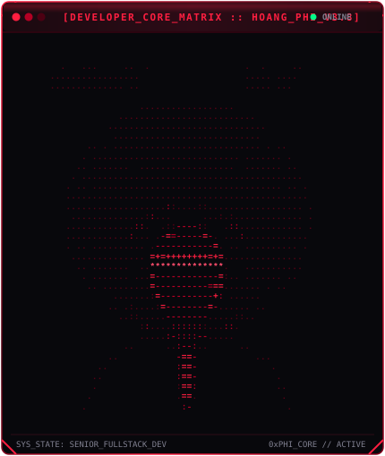

<div align="center">

  <!-- ================================================================= -->
  <!-- CINEMATIC CAPSULE BANNER: VENOM CRIMSON & DARK OLED               -->
  <!-- ================================================================= -->
  

  <br/><br/>

  <!-- ================================================================= -->
  <!-- TYPING SVG JETBRAINS MONO CRIMSON NEON                            -->
  <!-- ================================================================= -->
  <a href="https://github.com/phith752003">
    
  </a>

  <br/><br/>

  <!-- ================================================================= -->
  <!-- EXECUTIVE SHIELDS.IO BADGES (BLACK & CRIMSON #FF1E40)             -->
  <!-- ================================================================= -->
  <p align="center">
    <a href="https://github.com/phith752003"></a>
    <a href="#-technical-arsenal--core-skills"></a>
    <a href="#-technical-arsenal--core-skills"></a>
    <a href="#-dual-terminal-command-deck"></a>
    <a href="#-technical-arsenal--core-skills"></a>
    <a href="#-development-activity--telemetry"></a>
  </p>

</div>

---

<div align="center">
  <h2>⚡ DUAL TERMINAL COMMAND DECK ⚡</h2>
  <p><i>Hệ thống giám sát hiệu năng kỹ thuật thời gian thực của Kỹ sư Trần Hoàng Phi</i></p>
</div>

<!-- =================================================================== -->
<!-- DUAL TERMINAL TABLE: DEVELOPER MATRIX ASCII & NEOFETCH INFO CARD    -->
<!-- =================================================================== -->
<table align="center" border="0" cellpadding="0" cellspacing="0">
  <tr>
    <td align="center" valign="top" width="48%">
      
    </td>
    <td width="4%"></td>
    <td align="center" valign="top" width="48%">
      
    </td>
  </tr>
</table>

---

### 🛡️ TECHNICAL ARSENAL & CORE SKILLS

<div align="center">

  #### Frontend Architecture & Spatial Experiences
  <p>
    
    
    
    
    
    
  </p>

  #### Backend Systems & High-Velocity APIs
  <p>
    
    
    
    
    
    
  </p>

  #### Database, Caching & ORM
  <p>
    
    
    
    
    
  </p>

  #### DevOps, Infrastructure & System Design
  <p>
    
    
    
    
    
    
  </p>

</div>

---

<div align="center">

  ### 📊 DEVELOPMENT ACTIVITY & TELEMETRY
  <p><i>Chu kỳ hoạt động &amp; tần suất commit liên tục của Hoàng Phi trong 53 tuần</i></p>

  

  <br/><br/>

  <!-- =================================================================== -->
  <!-- DUAL TELEMETRY DECK: METRICS & TECH MATRIX CARDS                    -->
  <!-- =================================================================== -->
  <table align="center" border="0" cellpadding="0" cellspacing="0">
    <tr>
      <td align="center" valign="top" width="48%">
        
      </td>
      <td width="4%"></td>
      <td align="center" valign="top" width="48%">
        
      </td>
    </tr>
  </table>

</div>

---

### 🎯 ENGINEERING PHILOSOPHY & SYSTEM ARCHITECTURE

> *"Chất lượng phần mềm bắt đầu từ kiến trúc module rõ ràng, hiệu năng web mượt mà chuẩn 60 FPS và hệ thống backend chịu tải cao, sẵn sàng mở rộng mà không đánh đổi tính ổn định."*
> 
> — **Trần Hoàng Phi**, *Senior Full-Stack Web Developer*

```bash
# Sơ đồ kiến trúc ứng dụng Web Full-Stack phân tán (Modern Scalable Web Architecture)
[CLIENT LAYER]  ◄── Next.js 15 / React 19 / Three.js 60fps UI ──►  [EDGE / CLOUDFLARE]
                                          │
                               (RESTful API / WebSockets)
                                          ▼
[BACKEND CORE]  ◄── FastAPI / Node.js High-Concurrency Engine ──►  [DISTRIBUTED CACHE]
                                          │                                (Redis In-Memory)
                                   (Prisma / SQLAlchemy)
                                          ▼
[PERSISTENCE]   ◄────── PostgreSQL Relational Database Cluster ────────►  [DOCKER / K8S CLOUD]
```

---

<div align="center">

  ### 📡 TRANSMISSION NODES & CONNECT

  <p>
    <a href="https://github.com/phith752003">
      
    </a>
    &nbsp;
    <a href="https://github.com/phith752003/phith752003">
      
    </a>
    &nbsp;
    <a href="https://linkedin.com">
      
    </a>
    &nbsp;
    <a href="mailto:hoangphi.dev@gmail.com">
      
    </a>
  </p>

  <br/>

  <!-- ================================================================= -->
  <!-- FOOTER: FULL-STACK WEB ENGINEERING IDENTITY                       -->
  <!-- ================================================================= -->
  <p align="center">
    <code>FULL-STACK WEB ENGINEERING // MODERN DISTRIBUTED SYSTEMS</code><br/>
    <sub>⚡ Architected &amp; Maintained by <b>Trần Hoàng Phi</b> • Built with Clean Code &amp; High Performance ⚡</sub><br/>
    <sub>© 2026 Trần Hoàng Phi. All Engineering Rights Reserved. Transmitting on Crimson Wave #FF1E40.</sub>
  </p>

</div>
