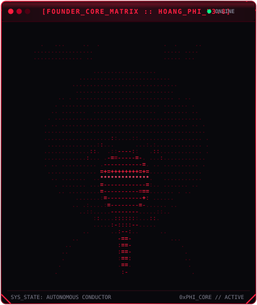
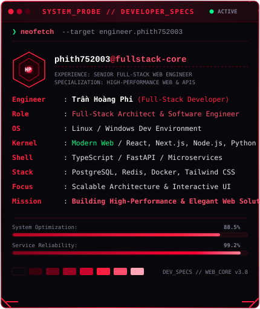
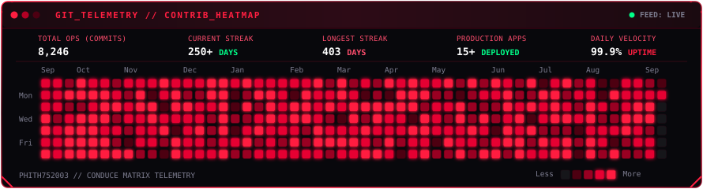
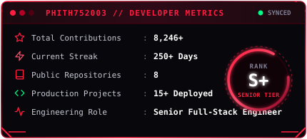
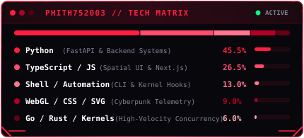

<div align="center">

  <!-- ================================================================= -->
  <!-- CINEMATIC CAPSULE BANNER: VENOM CRIMSON & DARK OLED               -->
  <!-- ================================================================= -->
  

  <br/><br/>

  <!-- ================================================================= -->
  <!-- TYPING SVG JETBRAINS MONO CRIMSON NEON                            -->
  <!-- ================================================================= -->
  <a href="https://github.com/phith752003">
    
  </a>

  <br/><br/>

  <!-- ================================================================= -->
  <!-- EXECUTIVE SHIELDS.IO BADGES (BLACK & CRIMSON #FF1E40)             -->
  <!-- ================================================================= -->
  <p align="center">
    <a href="https://github.com/phith752003"></a>
    <a href="#-mission--vision"></a>
    <a href="#-c-suite-autonomous-swarms"></a>
    <a href="#-dual-terminal-command-deck"></a>
    <a href="#-neural-armory--stack"></a>
    <a href="#-autonomous-contribution-telemetry"></a>
  </p>

</div>

---

<div align="center">
  <h2>⚡ DUAL TERMINAL COMMAND DECK ⚡</h2>
  <p><i>Hệ thống giám sát chỉ huy trực quan thời gian thực của Founder Hoàng Phi &amp; AI Company OS</i></p>
</div>

<!-- =================================================================== -->
<!-- DUAL TERMINAL TABLE: FOUNDER MATRIX ASCII & NEOFETCH INFO CARD       -->
<!-- =================================================================== -->
<table align="center" border="0" cellpadding="0" cellspacing="0">
  <tr>
    <td align="center" valign="top" width="48%">
      
    </td>
    <td width="4%"></td>
    <td align="center" valign="top" width="48%">
      
    </td>
  </tr>
</table>

---

### 🌐 C-SUITE AUTONOMOUS SWARMS

<div align="center">
  <p><i>Đội ngũ AI Agents tự hành trực thuộc quyền điều phối tối cao của Chief Conductor</i></p>
</div>

| Biệt Danh Agent | Chức Danh C-Suite | Phạm Vi Quyền Hạn | Trạng Thái Hoạt Động |
| :--- | :--- | :--- | :---: |
| **`ceo_agent`** | Strategic Orchestrator | Hoạch định chiến lược kinh doanh, phân bổ nguồn lực & định vị thị trường | `● OPERATIONAL` |
| **`cpo_planner`** | Product Architect | Thiết kế kiến trúc giải pháp, PRD, Roadmap & trải nghiệm người dùng | `● OPERATIONAL` |
| **`dev_coder`** | Engineering Squad | Phát triển mã nguồn Full-Stack, Tối ưu hóa thuật toán & CI/CD tự động | `● COMPILING` |
| **`qa_debugger`** | Security & Reliability | Kiểm thử tự động E2E, Sát hạch bảo mật hệ thống & Tự động phục hồi lỗi | `● ACTIVE` |
| **`growth_marketer`** | Viral Distribution | Tiếp thị tăng trưởng, Tối ưu SEO/AEO & Mạng lưới phân phối nội dung | `● SYNCHRONIZING` |
| **`finance_auditor`** | Tokenomics & Treasury | Quản trị ngân sách, Phân tích chỉ số tài chính PnL & Kiểm toán tự động | `● AUDITING` |

---

### 🛡️ NEURAL ARMORY & TECH STACK

<div align="center">

  #### Core Intelligence & Agent Swarms
  <p>
    
    
    
    
  </p>

  #### Backend & Distributed Systems
  <p>
    
    
    
    
    
  </p>

  #### Frontend & Spatial Cyber Experience
  <p>
    
    
    
    
  </p>

</div>

---

<div align="center">

  ### 📊 AUTONOMOUS CONTRIBUTION TELEMETRY
  <p><i>Chu kỳ hoạt động &amp; tần suất commit liên tục của Founder và đội ngũ AI Swarms trong 53 tuần</i></p>

  

  <br/><br/>

  <!-- =================================================================== -->
  <!-- DUAL TELEMETRY DECK: AUTONOMOUS METRICS & TECH MATRIX CARDS         -->
  <!-- =================================================================== -->
  <table align="center" border="0" cellpadding="0" cellspacing="0">
    <tr>
      <td align="center" valign="top" width="48%">
        
      </td>
      <td width="4%"></td>
      <td align="center" valign="top" width="48%">
        
      </td>
    </tr>
  </table>

</div>

---

### 🎯 MISSION & ARCHITECTURE PHILOSOPHY

> *"Chúng ta không còn lập trình theo cách thủ công từng dòng lệnh đơn lẻ.  
> Vai trò của người sáng lập trong kỷ nguyên mới là **Chief Conductor (Tổng Chỉ Huy)** — người kiến tạo tầm nhìn, thiết kế giao thức và điều khiển dàn hợp xướng các tác nhân AI tự hành vận hành trơn tru như một cỗ máy vĩnh cửu."*
> 
> — **Hoàng Phi**, *Chief Conductor @ AI Company OS*

```bash
# Sơ đồ luồng quyết định tự hành (Autonomous Orchestration Flow)
[CHIEF CONDUCTOR] ──(Vision & Objectives)──► [JARVIS FLOW ORCHESTRATOR]
                                                        │
         ┌───────────────────┬──────────────────────────┼──────────────────────────┐
         ▼                   ▼                          ▼                          ▼
   [CEO_AGENT]         [CPO_PLANNER]              [DEV_CODER]               [QA_DEBUGGER]
 (Strategy & PnL)   (Roadmap & Specs)       (High-Velocity Code)        (Telemetry & Tests)
```

---

<div align="center">

  ### 📡 NEURAL CHANNELS & TRANSMISSION NODES
  
  <p>
    <a href="https://github.com/phith752003">
      
    </a>
    &nbsp;
    <a href="https://github.com/phith752003/phith752003">
      
    </a>
    &nbsp;
    <a href="https://linkedin.com">
      
    </a>
    &nbsp;
    <a href="https://x.com">
      
    </a>
    &nbsp;
    <a href="mailto:founder@aicompany.os">
      
    </a>
  </p>

  <br/>

  <!-- ================================================================= -->
  <!-- FOOTER: CYBERPUNK CONDUCTOR IDENTITY                              -->
  <!-- ================================================================= -->
  <p align="center">
    <code>AI COMPANY OS // AUTONOMOUS ENTERPRISE FRAMEWORK</code><br/>
    <sub>⚡ Orchestrated by <b>Hoàng Phi</b> • Powered by Antigravity &amp; Gemini 3.8 Multi-Agent Swarms ⚡</sub><br/>
    <sub>© 2026 Hoàng Phi. All Neural Rights Reserved. Transmitting on Crimson Wave #FF1E40.</sub>
  </p>

</div>
